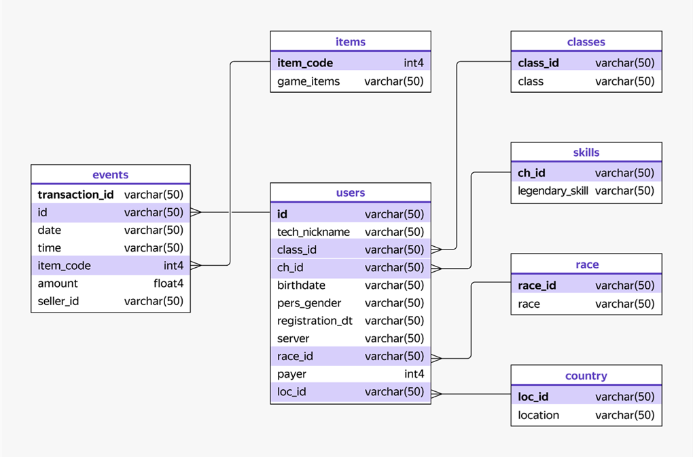

# Анализ данных онлайн-игры

## Описание проекта
В этом проекте будем работать с базой данных онлайн-игры в жанре RPG, в которой каждый игрок следует по сюжету своего персонажа, выполняет задания и исследует огромный виртуальный мир.

В начале игры при выборе персонажа пользователь выбирает расу и класс героя, которые влияют на характеристики персонажа и сюжетную линию.

В игре можно покупать и продавать разные вещи: оружие, доспехи, еду, магические предметы и амулеты. Для покупок используют внутриигровую валюту. Такой валюты в игре две:
•	Обычные монеты, которые можно заработать при прохождении игры. Они позволяют покупать обычные предметы.
•	Золотые монеты, за которые можно покупать эпические предметы. Такие предметы дают преимущество при прохождении игры. Золотые монеты можно получить за прохождение сложных квестов или купить за реальные деньги. Покупать эпические предметы можно у других игроков, торговцев и внутри игрового приложения.

Продажа Золотых монет — это основная часть дохода команды разработки. Команда игры планирует привлекать платящих игроков и продвигать покупку эпических предметов с помощью рекламы. Поэтому аналитику предстоит решить несколько задач: 
•	выяснить, какая доля игроков покупает Золотые монеты за реальные деньги и есть ли зависимость доли платящих игроков от расы персонажа;
•	детально изучить, как происходит покупка эпических предметов внутри игры.

## ER-диаграмма данных

## Описание таблиц
**Таблица `users`** - Содержит информацию об игроках
* `id` — идентификатор игрока (первичный ключ).
* `tech_nickname` — никнейм игрока.
* `class_id` — идентификатор класса (внешний ключ, который связан со столбцом `class_id` таблицы `classes`).
* `ch_id` — идентификатор легендарного умения (внешний ключ, который связан со столбцом `ch_id` таблицы `skills`).
* `birthdate` — дата рождения игрока.
* `pers_gender` — пол персонажа.
* `registration_dt` — дата регистрации пользователя.
* `server` — сервер, на котором играет пользователь.
* `race_id` — идентификатор расы персонажа (внешний ключ, который связан со столбцом `race_id` таблицы `race`).
* `payer` — значение, которое указывает, является ли игрок платящим — покупал внутриигровую валюту за реальные деньги. 1 — платящий, 0 — не платящий.
* `lоc_id` — идентификатор страны, где находится игрок (внешний ключ, который связан со столбцом `loc_id` таблицы `country`).

**Таблица `events`** - Содержит информацию о покупках
* `transaction_id` — идентификатор покупки (первичный ключ).
* `id` — идентификатор игрока (внешний ключ, который связан со столбцом `id` таблицы `users`).
* `date` — дата покупки.
* `time` — время покупки.
* `item_code` — код эпического предмета (внешний ключ, который связан со столбцом `item_code` таблицы `items`).
* `amount` — стоимость покупки во внутриигровой валюте.
* `seller_id` — идентификатор продавца.

**Таблица `skills`** - Содержит информацию о легендарных умениях
* `ch_id` — идентификатор легендарного умения (первичный ключ).
* `legendary_skill` — название легендарного умения.

**Таблица `race`** - Содержит информацию о расах персонажей
* `race_id` — идентификатор расы персонажа (первичный ключ).
* `race` — название расы.

**Таблица `country`** - Содержит информацию о странах игроков
* `lоc_id` — идентификатор страны, где находится игрок (первичный ключ).
* `location` — название страны

**Таблица `classes`** - Содержит информацию о классах персонажей
* `class_id` — идентификатор класса (первичный ключ).
* `class` — название класса персонажа.

**Таблица `items`** - Содержит информацию об эпических предметах
* `item_code` — код эпического предмета (первичный ключ).
* `game_items` — название эпического предмета.
